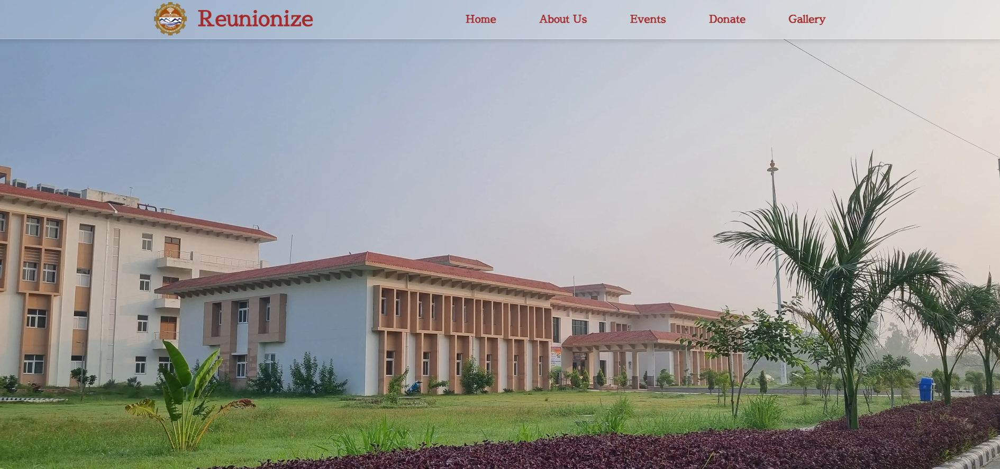
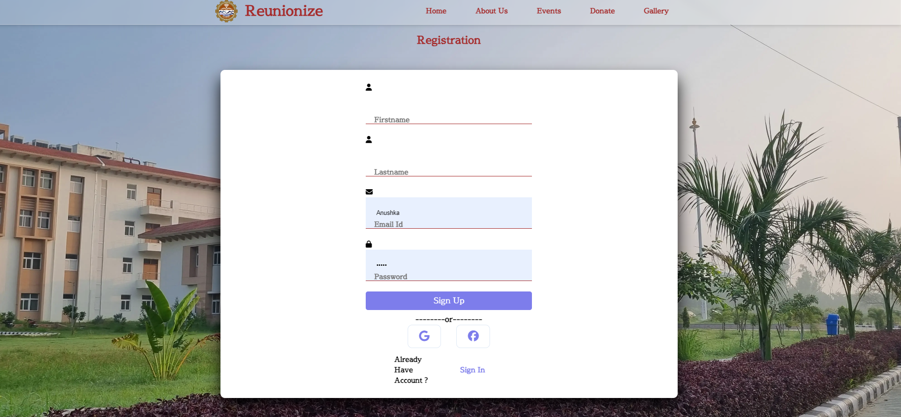
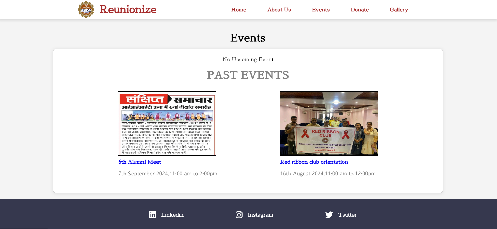
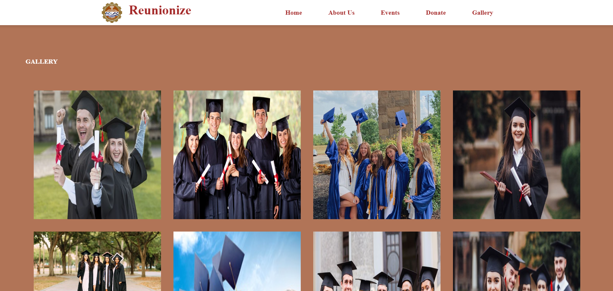

# alumni-portal-iiitu
# Reunionize – Alumni Portal for IIIT Una 🎓

A full-featured alumni portal built to connect students and alumni of IIIT Una.  
This platform provides alumni with a space to interact, contribute, and stay connected with their institute.

---

## 🚀 Features
- Alumni **Registration & Profiles**  
- **Event Management** (view upcoming events)  
- **Donations** portal  
- **Gallery** for sharing memories  
- **Newsroom** for announcements and updates  
- Integrated **Chatroom** for real-time alumni–student interaction  

---

## 🛠️ Tech Stack
- **Frontend:** HTML, CSS, JavaScript, React  
- **Backend:** Node.js, Express  
- **Database:** MongoDB  

---

## 📸 Screenshots  

### Home Page  
  

### Register Page  
  

### Events Page  
  

### Gallery  
  

### Donate Page  
  

---

## 📌 Note  
The original source code was lost, but this repository showcases the **design, features, and screenshots** of the Alumni Portal project.
